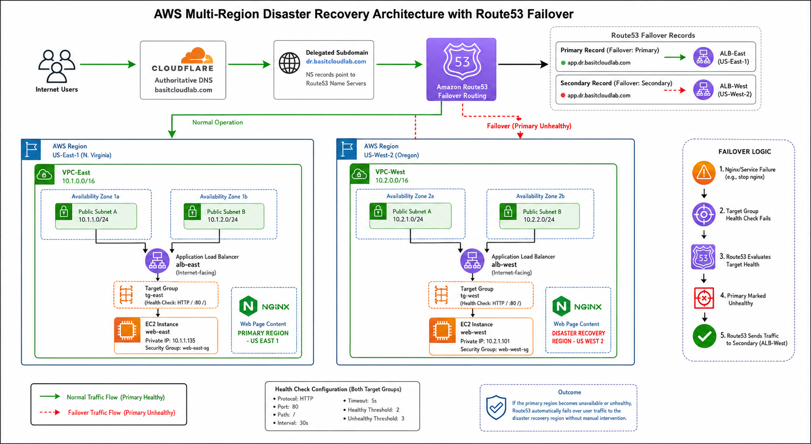

# AWS Multi-Region Disaster Recovery Lab

## Project Overview

This project demonstrates a Multi-Region Disaster Recovery (DR) architecture using AWS Route 53 Failover Routing, Application Load Balancers (ALBs), and EC2 instances deployed across two AWS regions.

The goal was to simulate a regional outage and validate automatic failover of user traffic from a primary region to a disaster recovery region without requiring manual DNS changes.

This project focused on user-facing application failover.

---

## Business Scenario

A company hosts a public web application in AWS.

If an entire AWS region becomes unavailable, users should automatically be redirected to a healthy copy of the application running in another region.

Requirements:

* No manual intervention
* Automatic health monitoring
* DNS-based failover
* Multi-region deployment
* Validation through simulated outage testing

## Solution Architecture




---

# Architecture

```text
Internet Users
       |
       v

Cloudflare DNS
       |
       v

Route53 Failover Record
(app.dr.basitcloudlab.com)

       |
       |
  Primary Healthy?
       |
   +---+---+
   |       |
  YES      NO
   |       |
   v       v

ALB-East  ALB-West
US-East   US-West

   |         |
   v         v

Web-East  Web-West
```

---

# AWS Regions

## Primary Region

```text
US-East-1 (N. Virginia)
```

Components:

* VPC-East
* Public Subnet East 1
* Public Subnet East 2
* Application Load Balancer
* EC2 Instance
* Nginx Web Server

---

## Disaster Recovery Region

```text
US-West-2 (Oregon)
```

Components:

* VPC-West
* Public Subnet West 1
* Public Subnet West 2
* Application Load Balancer
* EC2 Instance
* Nginx Web Server

---

# DNS Architecture

Cloudflare remained authoritative for:

```text
basitcloudlab.com
```

A delegated subdomain was created:

```text
dr.basitcloudlab.com
```

Delegation was performed using Route53 Name Server (NS) records.

```text
Cloudflare
      |
      +---- basitcloudlab.com

      +---- dr.basitcloudlab.com
                 |
                 v
              Route53
```

This allowed Route53 to manage Disaster Recovery records without affecting the rest of the domain.

---

# Build Process

## Step 1 - Create Regional Networks

Created:

### US-East

```text
VPC-East
10.1.0.0/16
```

Subnets:

```text
10.1.1.0/24
10.1.2.0/24
```

---

### US-West

```text
VPC-West
10.2.0.0/16
```

Subnets:

```text
10.2.1.0/24
10.2.2.0/24
```

---

## Step 2 - Configure Internet Connectivity

Created:

* Internet Gateways
* Public Route Tables

Added routes:

```text
0.0.0.0/0
```

toward the Internet Gateway.

Associated route tables with public subnets.

---

## Step 3 - Deploy EC2 Instances

Created:

### Primary

```text
web-east
```

### Disaster Recovery

```text
web-west
```

Installed:

```bash
sudo dnf install nginx -y
```

Configured custom pages to clearly identify which region was serving traffic.

Primary page:

```text
PRIMARY REGION - US EAST 1
```

DR page:

```text
DISASTER RECOVERY REGION - US WEST 2
```

---

## Step 4 - Create Target Groups

Created:

```text
tg-east
tg-west
```

Health Check:

```text
HTTP
Path: /
Port: 80
```

Target groups continuously monitored the health of Nginx.

---

## Step 5 - Create Application Load Balancers

Created:

```text
alb-east
alb-west
```

Important learning:

Application Load Balancers require a minimum of two subnets across different Availability Zones.

This requirement was discovered during deployment.

---

## Step 6 - Configure Route53

Created Hosted Zone:

```text
dr.basitcloudlab.com
```

Created Failover Records:

### Primary Record

```text
app.dr.basitcloudlab.com
```

Points to:

```text
alb-east
```

Failover Type:

```text
Primary
```

---

### Secondary Record

```text
app.dr.basitcloudlab.com
```

Points to:

```text
alb-west
```

Failover Type:

```text
Secondary
```

Enabled:

```text
Evaluate Target Health
```

---

# Target Health vs Route53 Health Checks

## Target Health (Used in this Lab)

Route53 asked the ALB:

```text
Are your targets healthy?
```

The ALB checked:

```text
Target Group
       |
       v
EC2 Instance
       |
       v
Nginx Service
```

When Nginx stopped:

```text
Target Group
      ↓
Unhealthy
```

Route53 detected the unhealthy state and failed over traffic.

Advantages:

* Simpler
* No additional Route53 health checks
* Tight AWS integration

---

## Route53 Health Checks

Route53 can directly test:

```text
HTTP
HTTPS
TCP
```

against a public endpoint.

Example:

```text
https://app.company.com/health
```

Advantages:

* More granular monitoring
* Independent verification
* Faster tuning options

Disadvantages:

* Additional configuration
* Additional cost

---

# Validation Testing

## Test 1 - Primary Region Access

Accessed:

```text
app.dr.basitcloudlab.com
```

Result:

```text
PRIMARY REGION - US EAST 1
```

PASS

---

## Test 2 - Regional Failure Simulation

Executed:

```bash
sudo systemctl stop nginx
```

on:

```text
web-east
```

Result:

```text
Target Group Status
Unhealthy
```

PASS

---

## Test 3 - Automatic DNS Failover

Observed:

```text
app.dr.basitcloudlab.com
```

switch from:

```text
US-East
```

to:

```text
US-West
```

without changing the URL.

PASS

---

## Test 4 - Disaster Recovery Validation

Result:

```text
DISASTER RECOVERY REGION - US WEST 2
```

displayed successfully.

PASS

Observed failover time:

```text
~3 minutes
```

---

# Troubleshooting

## Issue 1

Problem:

```text
ALB-East timed out
```

Root Cause:

Wrong Security Group attached to the ALB.

Resolution:

Attached correct ALB Security Group allowing:

```text
HTTP 80
```

Result:

ALB immediately became reachable.

---

## Issue 2

Problem:

ALB creation failed.

Root Cause:

Only one subnet existed.

Resolution:

Created second subnet in another Availability Zone.

Learning:

Internet-facing ALBs require subnets in multiple Availability Zones.

---

# Comparison With Previous Transit Gateway Project

Previous project:

```text
Transit Gateway Peering
```

Purpose:

```text
Internal application communication
```

Examples:

* VPC-to-VPC connectivity
* Database replication
* Internal services
* Private routing

---

Current project:

```text
Route53 Failover Routing
```

Purpose:

```text
User-facing disaster recovery
```

Examples:

* Website failover
* Regional failover
* Public application resilience

---

# Future Enhancement

Next planned architecture:

```text
Users
   |
Route53
   |
Primary Region
   |
Transit Gateway
   |
Secondary Region
```

Combining:

* Route53 Failover
* Transit Gateway
* Multi-Region Networking
* Application Disaster Recovery
* Internal Replication

This design will provide both:

* User traffic failover
* Backend service connectivity

---

# Skills Demonstrated

* AWS VPC
* Multi-Region Design
* Route53
* DNS Delegation
* Cloudflare Integration
* Application Load Balancer
* Target Groups
* Health Checks
* Disaster Recovery
* Nginx
* EC2
* DNS Failover
* Troubleshooting
* Cloud Networking

---

# Resume Bullet

Designed and implemented a multi-region AWS disaster recovery solution using Route53 failover routing, Cloudflare DNS delegation, Application Load Balancers, and EC2 instances across US-East-1 and US-West-2. Validated automatic regional failover by simulating application outages and observing successful traffic redirection to the disaster recovery environment.
